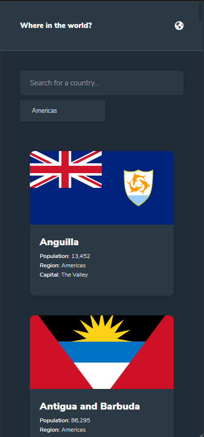
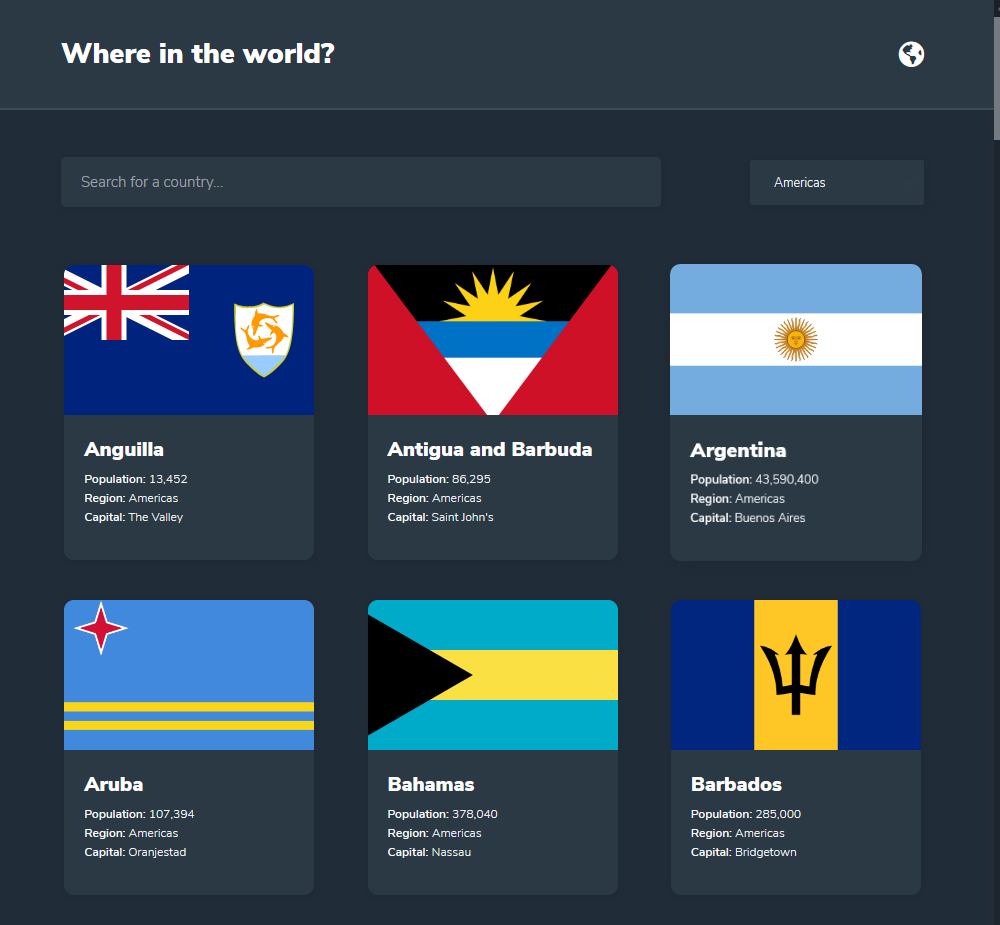
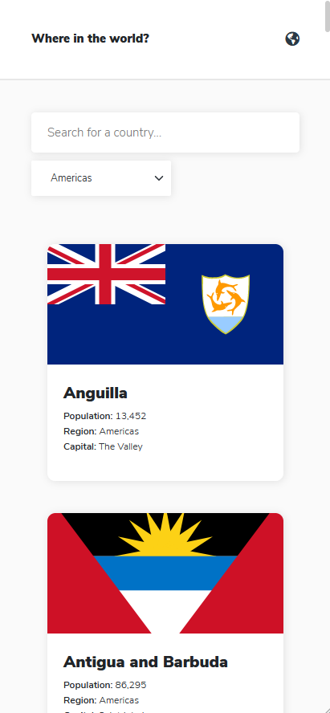
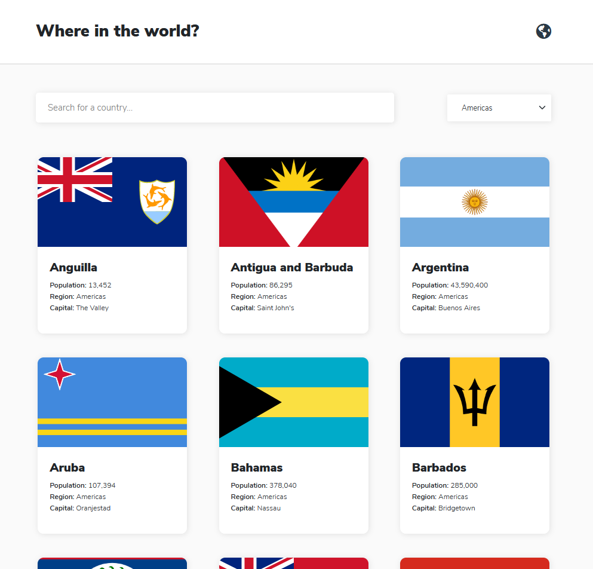

# REST Countries API with color theme switcher solution

This is a solution to the [REST Countries API with color theme switcher challenge on Frontend Mentor](https://www.frontendmentor.io/challenges/rest-countries-api-with-color-theme-switcher-5cacc469fec04111f7b848ca). Frontend Mentor challenges help you improve your coding skills by building realistic projects.

## Table of contents

- [Overview](#overview)
  - [The challenge](#the-challenge)
  - [Screenshot](#screenshot)
  - [Links](#links)
- [My process](#my-process)
  - [Built with](#built-with)
  - [What I learned](#what-i-learned)
  - [Continued development](#continued-development)
- [Author](#author)
- [Acknowledgments](#acknowledgments)

## Overview

This was an awesome challenge to practice Rest APIs skills. It was pretty fun to load 250+ countries.

### The challenge

Users should be able to:

- See all countries from the API on the homepage
- Search for a country using an `input` field
- Filter countries by region
- Click on a country to see more detailed information on a separate page
- Click through to the border countries on the detail page
- Toggle the color scheme between light and dark mode _(optional)_

### Screenshot






### Links

- Solution URL: [https://github.com/ehidalgo506-dev/Rest-Countries-API-with-theme-switcher](https://your-solution-url.comhttps://github.com/ehidalgo506-dev/Rest-Countries-API-with-theme-switcher)
- Live Site URL: [https://ehidalgo506-dev.github.io/Rest-Countries-API-with-theme-switcher/](https://your-live-site-url.comhttps://ehidalgo506-dev.github.io/Rest-Countries-API-with-theme-switcher/)

## My process

I started by doing a flowchart of the main features that the project should have. After I had to decide what coding structure I want to use and in this case I chose OOP (Object Oriented Programming).

I first started by the design, dividing everything into sections and fully complete that section (responsive) with HTML and CSS.

In this case I wanted to make a little change for the dark mode and wanted to implement the new feature called "prefer-scheme: dark" which will choose certain properties based on the setting of the device (dark mode). For example, if the device has Dark Mode enable then the website will be loading in dark mode.

And after that, start coding! <3

First I did the main home page to show all the countries, worked on the search and filter features to then move to the detail page of the country.

### Built with

- Semantic HTML5 markup
- CSS custom properties
- Flexbox
- CSS Grid
- SCSS
- Mobile-first workflow
- Bootstrap V5
- Vainilla JS

### What I learned

How to implement dark mode based on user device preference.
Reinforcement of working with array methods, async functions, local storage and OOP.

```css
/* Responsive design Mixins */
$phone-mini: 320px;
$phone: 480px;
$table: 768px;
$table-land: 1024px;
$desktop: 1800px;

@mixin responsiveMax($breakpoint) {
  @media (max-width: $breakpoint/16px*1em) {
    @content;
  }
}
@mixin responsiveMin($breakpoint) {
  @media (min-width: $breakpoint/16px*1em) {
    @content;
  }
}
/* Mixin for Dark mode Base on user preference */
@mixin darkMode() {
  @media (prefers-color-scheme: dark) {
    @content;
  }
}
```

```js
// Search a country based on the user input and the filter applied
 _searchCountry() {
    const input = inputSearch.value.toLowerCase().trim();
    const select = inputSelect.value;
    const filterCountries = this._countries.filter((country) => {
      if (select === "") {
        return country.name.toLowerCase().startsWith(input);
      }

      return (
        country.name.toLowerCase().startsWith(input) &&
        country.region === select
      );
    });
    this._renderCountries(filterCountries);
  }

```

### Continued development

Still sometimes I struggle with OOP. I need to continue practicing by doing more projects.

Want to learn more about implementing dark mode but based on a toggle, last project I faced some inheritance issues and needed to use !important which it is not recommended.

Instead of working with local Storage to have data from 1 page to another I will implement imports & exports.

## Author

- Github - [https://github.com/ehidalgo506-devAdd your name here](https://github.com/ehidalgo506-dev)
- Frontend Mentor - [@ehidalgo506-dev](https://www.frontendmentor.io/profile/yourusernamehttps://www.frontendmentor.io/profile/ehidalgo506-dev)
- LinkedIn - [@ehidalgo204](https://www.linkedin.com/in/ehidalgo204/)
  worked in a team or got some inspiration from someone else's solution. This is the perfect place to give them some credit.

**Note: Delete this note and edit this section's content as necessary. If you completed this challenge by yourself, feel free to delete this section entirely.**
